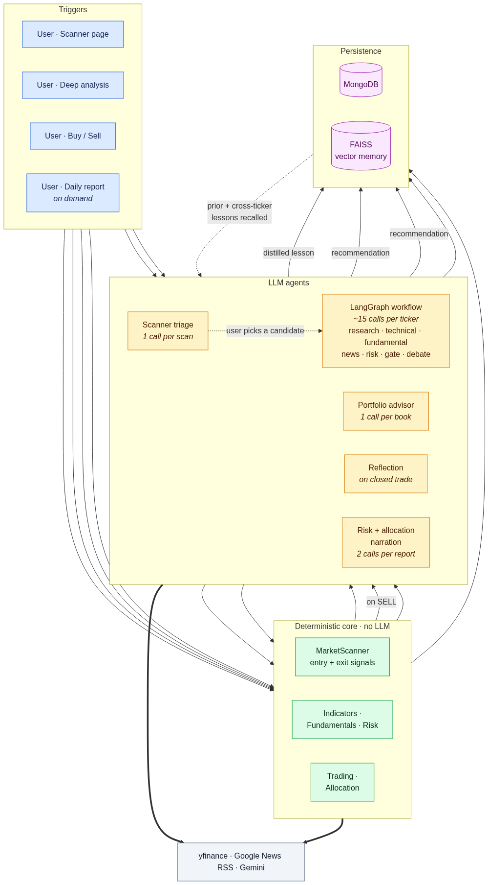
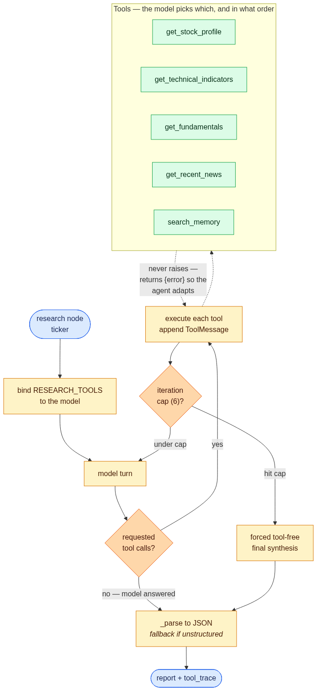
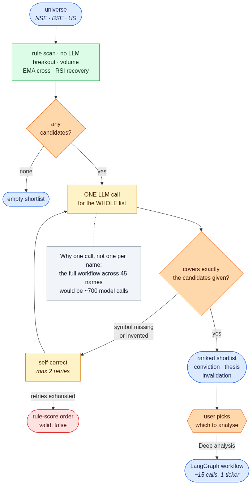
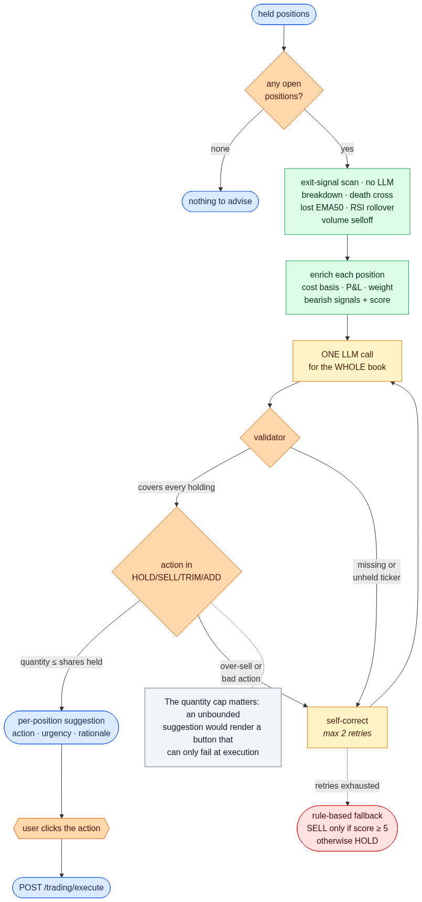
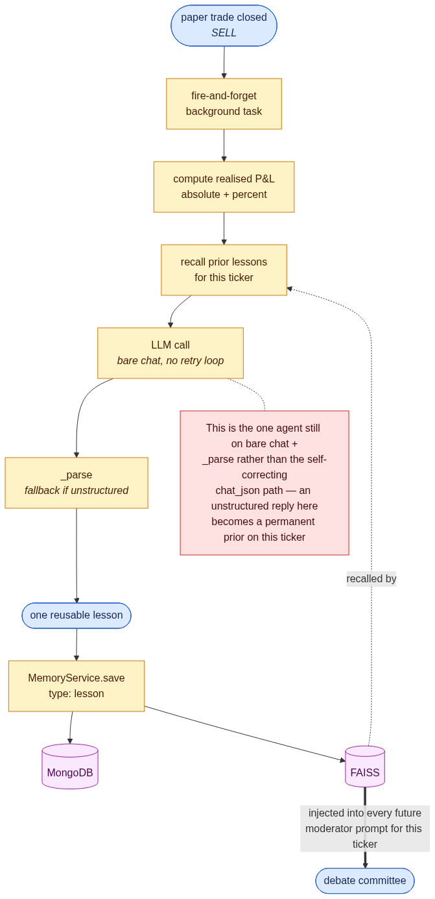
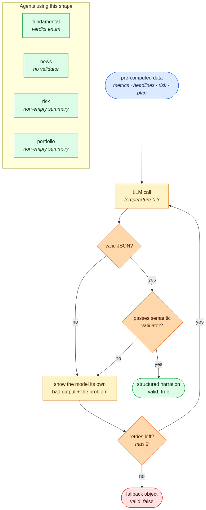
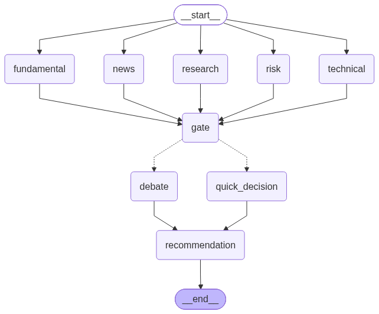
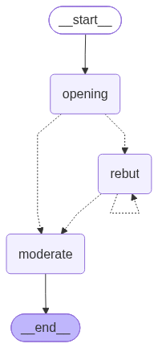

# AlphaForge AI

Local-first autonomous investment research & paper trading platform.

## Stack

- Frontend: Next.js 16 (App Router) + React 19, TypeScript, Tailwind v4, shadcn/ui
  (base-lyra, on Base UI), TanStack Query, Zustand, lightweight-charts
- Backend: FastAPI, Python 3.12
- Database: MongoDB (Beanie) + FAISS (vector memory)
- AI: Google Gemini + LangGraph

## System overview

Nine LLM agents, but only some of them live inside the LangGraph workflow. This
view is organised by what **triggers** each agent, which is the thing the graph
diagrams can't show:



The layering is deliberate. A deterministic core does all the market maths with
no LLM involved, agents sit on top of it to interpret and explain, and the cost
of each agent is very different:

| Agent | Trigger | Cost |
| --- | --- | --- |
| Scanner triage | Scanner page | 1 call per scan |
| Portfolio advisor | Scanner page | 1 call per book |
| LangGraph workflow | Scanner candidate, or a direct search on Analyze | ~15 calls per ticker |
| Reflection | A paper trade is closed | 1 call per closed trade |
| Risk + allocation narration | `POST /api/reports/daily`, on demand | 2 calls per report |

That gap is why scanning is tiered — running the full workflow across a whole
universe would be hundreds of model calls, so the scan shortlists cheaply and the
user chooses which candidates earn the expensive analysis.

Every outbound model call also passes through a shared rate limiter
(`app/core/ratelimit.py`) enforcing requests-per-minute, tokens-per-minute and
requests-per-day against the provider quota. Chat and embeddings have separate
budgets; token cost is estimated up front and then corrected with the real count
from the response.

The two horizons behave differently on purpose. **Per-minute** overruns make the
caller *wait* — a few seconds in a request that already takes tens of them. The
**daily** cap instead *rejects* with `429` and a `Retry-After`, because the reset
is midnight US Pacific and no browser should hold a connection for that. Because
a daily count that resets on redeploy is worthless, it lives in Mongo
(`daily_quota_usage`) rather than in memory.

Two consequences to keep in mind:

- **The limiter is per-process.** It is a plain object holding a `deque` and an
  `asyncio.Lock`, so a second uvicorn worker or a second container means a second
  full budget against one shared quota. Run exactly one — that's why the
  Dockerfile pins `--workers 1`.
- **Retries have to stay off.** `ChatGoogleGenerativeAI` defaults to six internal
  retries; each is a real request the limiter never sees, and 429s are what
  trigger them. `LLMService._client` sets `max_retries=1` (the SDK reads `0` as
  "use the default", not "none").

`GET /api/reports/quota` returns both budgets, per-minute and per-day, with the
reset time.

## Per-agent flows

There are nine agents but only five distinct shapes — the four narration agents
share one. Each diagram below is a different *kind* of agent, not a different
name for the same thing.

### Research — the only autonomous tool loop



The model is bound to five tools and decides at run time which to call and in
what order, looping until it stops asking for data or hits the 6-iteration cap
(where a tool-free synthesis is forced so callers never get a dangling tool
request). Tools never raise — they return `{error}` so the agent can proceed on
partial evidence. This is the one agent whose control flow the model owns.

### Scanner triage — batch fan-in



One LLM call ranks the **entire** shortlist. The validator enforces exact
coverage: a dropped symbol would silently shrink your shortlist, and an invented
one would render an "Analyze" button for a stock that never scanned.

The universe it ranks is **discovered live**, not hardcoded. A discovery tier
asks Yahoo's screener for today's movers — `day_gainers` for the US, a
region-scoped `EquityQuery` for NSE/BSE — dedupes dual listings (preferring
`.NS` over `.BO`), and feeds those into the existing signal detection. This
matters because a breakout scanner restricted to a fixed list of large caps
filters out exactly the mid/small caps that actually move. The old hardcoded
lists survive only as an offline fallback when the screener is unavailable, and
the response reports which was used via `universe_source`
(`discovery` / `fallback` / `explicit`).

### Portfolio advisor — bounded actions



Deterministic exit signals are computed first, then one call reasons over the
whole book. The validator caps `suggested_quantity` at shares actually held —
without it the UI could render a Sell button that can only fail at execution.

### Reflection — the learning loop



Fires on a closed trade and writes a distilled lesson into FAISS, which is then
injected into future moderator prompts. Recall is deliberately **not** restricted
to the ticker the lesson came from: a lesson records a mistake or a pattern, not a
fact about a company, so `_recall_memory` runs a second ticker-unscoped search
keyed on the *current setup* — sector, trend, momentum, financial health — and
returns those as `cross_ticker_lessons`, kept separate from the stock's own
history so the moderator never reads another company's blow-up as this one's.

Because lessons are only written when a trade is closed, an empty recall is
normal on a fresh install — and would otherwise be indistinguishable from a
broken loop. Every recall therefore carries a `status`
(`ok` / `no_lessons_yet` / `index_unavailable` / `index_degraded`), surfaced on
the recommendation as `explanation.learned_context.status`, and
`GET /api/memory/health` answers the same question directly by comparing what
Mongo holds against whether the FAISS index exists.

A lesson is permanent and gets replayed into later debates, including on other
tickers, so this agent runs on the same self-correcting `chat_json` path as the
narrators — with a validator requiring a non-empty `lesson` and an `outcome` of
`WIN`/`LOSS`/`BREAKEVEN`. If the model still can't produce one after its retries,
**nothing is stored**: a malformed reply must not become a prior that every future
debate reads as advice. The reported `outcome` stays correct regardless, because
it is computed from realised P&L rather than taken from the model.

### Narration agents — shared shape



`fundamental`, `news`, `risk` and `portfolio` all take pre-computed numbers and
produce a plain-language read through the same self-correcting loop: on invalid
JSON or a failed semantic check, the model is shown its own bad output and asked
to fix it, up to twice, before falling back with `valid: false`.

## Agent workflow

Every per-ticker analysis runs through a single LangGraph workflow — there is no
other path that produces a recommendation.



Five data-gathering nodes fan out in parallel, then `gate` acts as a fan-in
barrier and scores how strongly the signals agree:

- **research** — an autonomous ReAct loop; the model picks which tools to call
  (profile, technicals, fundamentals, news, memory) and in what order
- **technical** — deterministic `pandas_ta` indicators, no LLM
- **fundamental** — computed metrics plus a plain-language read
- **news** — RSS headlines summarised and scored for sentiment
- **risk** — single-stock volatility and beta, measured against the ticker's own
  market index (Nifty 50 for `.NS`/`.BO`, S&P 500 for US), no LLM

`gate` then routes conditionally. If the *independent* signals are unanimous and
the research agent doesn't dissent, the expensive committee is skipped via
`quick_decision`. Otherwise the debate runs. The research agent's vote is
deliberately excluded from the unanimity test — it reads the same underlying
evidence as technical/fundamental/news, so counting it as a peer would
double-count that evidence and manufacture agreement.

Risk deliberately does **not** vote. Volatility isn't directional — a high-beta
name in a strong uptrend is still a buy — so folding it into a BUY/SELL tally
would conflate "risky" with "bearish". Instead it can only make the system *less*
certain: a high-risk ticker caps confidence at `MEDIUM` (never changing the
BUY/SELL call), recorded as `explanation.risk.confidence_capped`. Portfolio-level
risk — Sharpe, sector concentration, book beta — stays out of this per-ticker
graph and is computed in the daily report, where a whole-book view actually
exists.

### Committee subgraph

When signals conflict, `debate` runs a cyclic Bull vs Bear subgraph:



Bull and Bear argue concurrently, then `rebut` loops — the self-edge is the
cycle — until the analysts converge (one concedes, or neither has new points) or
the round cap is hit. `moderate` issues the final verdict, which is validated
rather than silently falling back, so a real HOLD is distinguishable from a
parse failure.

## Accounts

Every book, lesson, memory and past recommendation belongs to one account. The API
carries no ambient identity: `user_id` comes from the bearer token on the request
and nothing else, so there is no code path that reads or writes another user's data.

| Endpoint | Public? |
| --- | --- |
| `POST /api/auth/register` | yes, unless `ALLOW_REGISTRATION=false` |
| `POST /api/auth/login` | yes |
| `GET /api/health` | yes — uptime pings need it |
| everything else | bearer token required |

Registration creates the opening paper-trading book in the same request, so a fresh
account's first portfolio read isn't a special case. Passwords are bcrypt-hashed
(SHA-256 pre-folded, since bcrypt ignores anything past 72 bytes); sessions are
HS256 JWTs signed with `JWT_SECRET`.

Two consequences worth knowing:

- **The daily report is per-caller.** It reports on the requesting user's own book
  and is only ever user-triggered, so nothing spends model quota unattended. A
  second concurrent request from the same account gets `409`, and the endpoint
  checks up front that the day's budget can cover the two calls it needs rather
  than half-building a report and dying.
- **There is no token revocation.** Changing a password stops future logins with the
  old one but doesn't invalidate tokens already issued — they run out at
  `ACCESS_TOKEN_TTL_MINUTES`. Deactivating a user (`is_active=false`) *does* take
  effect immediately, since every request re-reads the account.

The client keeps its token in `localStorage` rather than an httpOnly cookie, because
the frontend and API sit on different origins and cookies would have to be
`SameSite=None`. That trades CSRF exposure for XSS exposure — the right call for a
paper-trading app holding no money and no PII, and worth revisiting if that changes.

## Frontend

Seven pages — six behind the session gate, plus `/login`. The expensive analysis
pipeline is reachable from exactly two places (discovery and direct search) rather
than scattered:

| Route | What it's for |
| --- | --- |
| `/` | Dashboard — book value, cash, P&L, top holdings, quick actions |
| `/scanner` | Live movers → signals → LLM triage → pick one for deep analysis |
| `/market` | Look up any listing, chart it, paper-trade it; watchlist lives here |
| `/analyze` | Run the full pipeline on any ticker; past calls listed below it |
| `/portfolio` | Full book with native *and* base-currency columns; inline trade |
| `/transactions` | Executed paper trades |
| `/login` | Sign in / create an account — the only route outside the app frame |

The committee debate is **not** its own page — it's a phase of the analysis
pipeline, so it renders live inside `/scanner` and `/analyze` wherever a run takes
the debate path. Watchlist is a panel on `/market` rather than a separate route,
since starring a ticker and looking one up are the same task.

Notes worth knowing:

- **Streaming.** `/analyze` and `/scanner` consume Server-Sent Events directly
  (`streamWorkflow` / `streamDebate` in `src/lib/api.ts`), rendering each pipeline
  node, every debate round, and the final recommendation as they arrive. These use
  `fetch` rather than `EventSource` specifically because `EventSource` can't send
  headers — the bearer token would have to go in the query string, and from there
  into access logs.
- **The gate is `AppShell`, not middleware.** It decides between the sign-in screen,
  a spinner while the stored token is checked, and the app frame. It's a
  convenience only: the API rejects unauthenticated requests either way. Signing out
  clears the React Query cache, so the next account can't read the previous one's
  portfolio out of it.
- **Currency is never assumed.** `currency()` requires an explicit code at the
  call site — a defaulted `"USD"` is what once made ₹ positions render as dollars.
  INR uses `en-IN` lakh/crore grouping. Positions show their listing currency next
  to the book's base currency; a position with no FX rate is excluded from the
  total and named in `unconverted` rather than silently mis-added.
- **Theme.** Light and dark via `next-themes`, with semantic `--positive` /
  `--negative` tokens kept separate from the brand accent so "up" is never the
  same colour as "primary".
- **Charts** use hardcoded hex palettes rather than the CSS design tokens —
  lightweight-charts cannot parse `oklch()`/`lab()` and throws if handed one.

## Regenerating the diagrams

```powershell
cd backend
.\.venv\Scripts\python.exe ..\docs\generate_diagrams.py
```

| Diagram | Source | Drift risk |
| --- | --- | --- |
| `mermaid.png` | Exported from the compiled workflow graph | None — derived from code |
| `debate-subgraph.png` | Exported from the compiled debate graph | None — derived from code |
| `system.png` | Hand-authored `system.mmd` | **Can drift** — update when the architecture changes |
| `agent-*.png` | Hand-authored `agent-*.mmd` | **Can drift** — update when an agent's flow changes |

The two graph exports are generated by LangGraph from the compiled objects, so
they always match the code. The system diagram is maintained by hand, because
there is no single graph object that spans the API surface, the standalone agents
and the trade-close reflection path.

> `draw_mermaid_png()` renders via the mermaid.ink web service unless
> `pyppeteer` is installed locally. Pass `--mmd-only` to refresh just the text
> sources with no network call. The `.mmd` files are committed alongside the
> images so every diagram stays reviewable in plain text.

## Prerequisites

- Node.js 20+
- Python 3.12+
- MongoDB running on `localhost:27017` (or update `MONGODB_URI`)

## Setup

### Backend

```powershell
cd backend
uv sync
copy .env.example .env
uv run uvicorn app.main:app --reload --port 8000
```

Two values in `backend/.env` need filling in:

- `GOOGLE_API_KEY` — powers both the reasoning agents and the FAISS memory embeddings.
- `JWT_SECRET` — signs session tokens. Generate one per environment with
  `python -c "import secrets; print(secrets.token_urlsafe(48))"`. Leaving it unset
  falls back to a value published in this repo, so anyone could forge a token for any
  account; the server logs a warning at startup when that happens.

Note the CORS variable is `CORS_ORIGIN`, **singular** — `Settings.cors_origin` is the
field name, so a plural `CORS_ORIGINS` is silently ignored and the backend keeps its
`localhost:3000` default. Deployed, that shows up as the browser blocking every
request from the frontend.

### Frontend

```powershell
cd frontend
npm install
npm run dev
```

The app runs on `http://localhost:3000` and expects the API on
`http://localhost:8000`. CORS is pinned to that origin via `CORS_ORIGIN`.