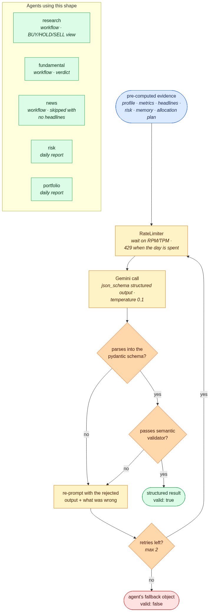
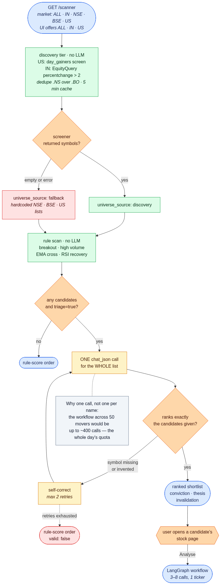
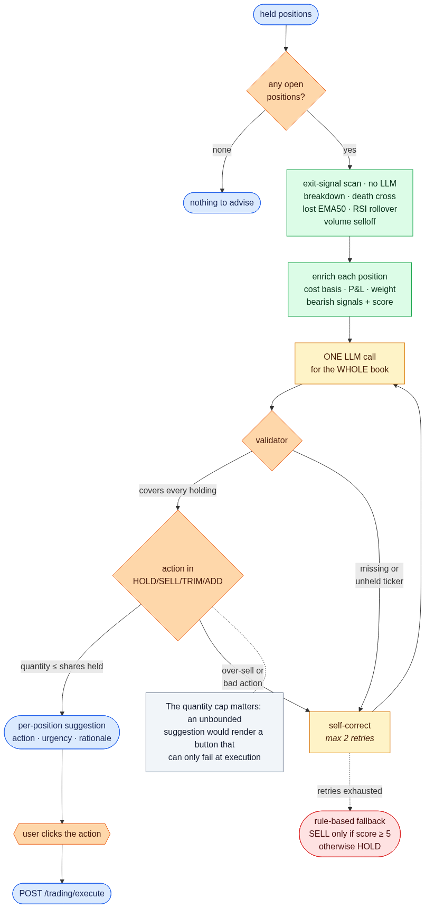
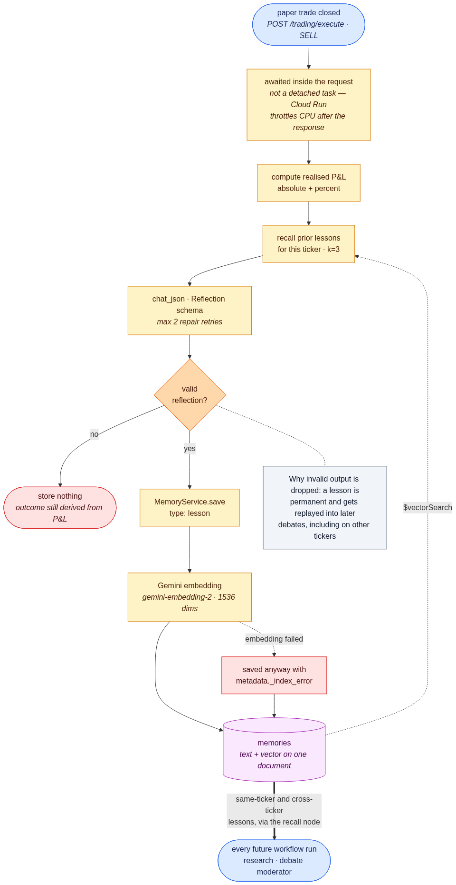
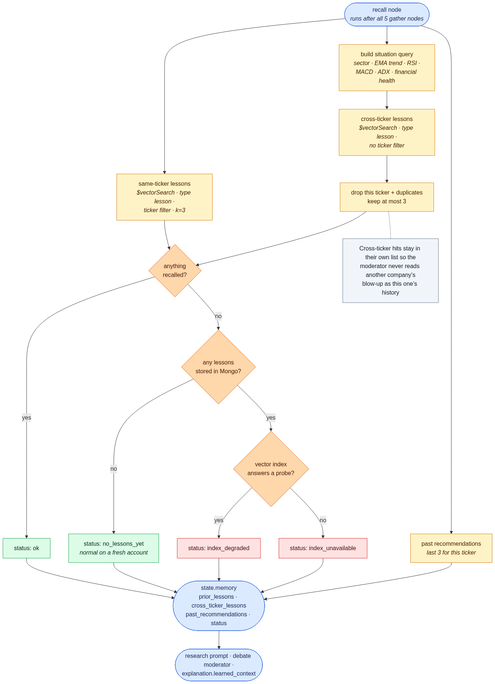

# Agents and memory

Every LLM agent, the shapes they share, and the long-term memory that closes the learning loop.

## Agents

All agents share one call path. The four shapes that actually differ each get a
diagram.

### Structured narration — research, fundamental, news, risk, portfolio

`LLMService.chat_json` asks Gemini for `json_schema` structured output (temperature
0.1 across all agents), parses it into a strict pydantic schema
(`backend/app/agents/schemas.py`, `extra="forbid"`, non-blank text), and runs an
optional semantic validator. On failure the model is shown its own rejected output
and what was wrong, up to twice, before the agent's fallback is returned with
`valid: false`. Research, fundamental and news run inside the workflow (news makes no
call when there are no headlines); risk and portfolio narrate the daily report.

### Scanner triage — batch fan-in

One call ranks the **entire** shortlist. The validator enforces exact coverage: a
dropped symbol would silently shrink the shortlist, and an invented one would offer
analysis on a stock that never scanned. If it can't be satisfied, the rule-score
order is returned with `valid: false`.

The universe it ranks is **discovered live**, not hardcoded. Yahoo's screener
supplies today's movers — `day_gainers` for the US, an `EquityQuery` for Indian
listings up more than 2% — deduplicated across dual listings (preferring `.NS` over
`.BO`) and cached for five minutes. A breakout scanner restricted to a fixed list of
large caps filters out exactly the mid and small caps that actually move. The old
lists survive only as an offline fallback, and the response reports which was used
via `universe_source` (`discovery` / `fallback` / `explicit`).

### Portfolio advisor — bounded actions

Exit signals (breakdown, EMA death cross, lost EMA50, RSI rollover, high-volume
selloff) are computed first, then one call reasons over the whole book. The validator
requires every holding exactly once and caps `suggested_quantity` at shares actually
held — without it the UI could render a Sell button that can only fail at execution.
If the model can't comply, the fallback is rule-based: SELL only when the bearish
score is ≥ 5, otherwise HOLD. It never invents a sell.

### Reflection — the learning loop

Every paper SELL calls the reflection agent with the realised P&L and prior lessons
for that ticker. It is **awaited inside the trade request**, not fired as a
background task: Cloud Run throttles CPU once a response is sent, so a detached task
may never run — and the failure would be silent, since existing memories stay
healthy while new ones just never arrive.

A lesson is permanent and gets replayed into later debates, including on other
tickers, so if the model can't produce a valid reflection **nothing is stored** — a
malformed reply must not become a prior that every future debate reads as advice. The
reported `outcome` stays correct regardless, because it is computed from realised P&L
rather than taken from the model.

## Memory and the learning loop

Memories (`user_preference`, `research_report`, `agent_output`, `lesson`) live in the
`memories` collection with their embedding **on the same document**, searched with
Atlas `$vectorSearch`. Moving off a local FAISS index is what made the backend
stateless enough for Cloud Run.

- Embeddings: `models/gemini-embedding-2` at 1536 dimensions.
- Every search pre-filters on `user_id` (and `type` / `ticker` where given), so recall
  can never cross accounts.
- If embedding fails, the entry is still saved with `metadata._index_error` rather
  than lost.
- If the embedding quota is spent, search returns nothing rather than failing the
  analysis.

The `recall` node gathers three things:

Recall is deliberately **not** restricted to the ticker a lesson came from. A lesson
records a mistake or a pattern, not a fact about a company, so a second,
ticker-unscoped search is keyed on the *current setup* — sector, trend, momentum,
financial health — and returned as `cross_ticker_lessons`, kept separate from the
stock's own history so the moderator never reads another company's blow-up as this
one's.

Because lessons are only written when a trade is closed, an empty recall is normal on
a fresh account — and would otherwise be indistinguishable from a broken loop. Every
recall therefore carries a `status` (`ok` / `no_lessons_yet` / `index_degraded` /
`index_unavailable`, plus `unknown` / `unavailable` when recall itself failed),
surfaced as `explanation.learned_context.status`. `GET /api/memory/health` answers the
same question directly from per-type counts, unembedded entries and a probe query
against the index.

> **The index must be an Atlas *Vector Search* index** (`{"fields": [...]}`), not an
> Atlas Search index (`{"mappings": ...}`). `$vectorSearch` against the wrong type
> raises nothing and matches nothing forever, and the health probe can't tell the
> two apart — only a real search returning hits proves recall works. The index
> definition is in [`backend/README.md`](../backend/README.md).
