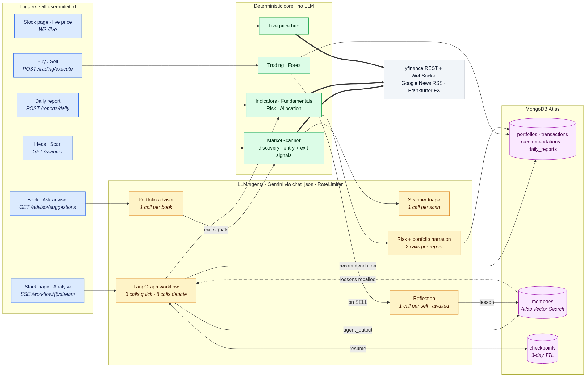
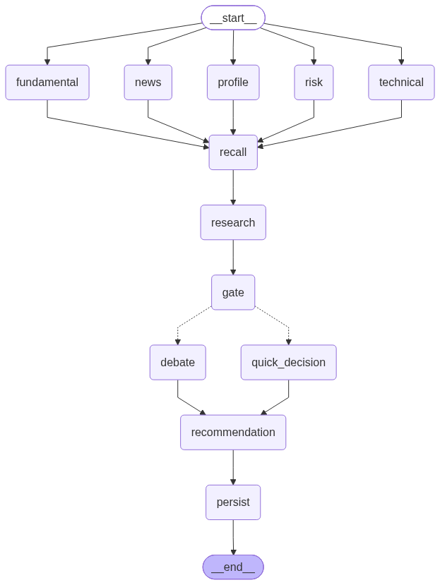
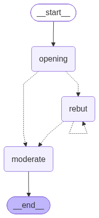

# Architecture

How a recommendation is produced: the system layout, the LangGraph workflow, the committee subgraph, and how runs are checkpointed and streamed.

## System overview

Only some agents live inside the LangGraph workflow. This view is organised by what
**triggers** each one — the thing the graph diagrams can't show:

The layering is deliberate. The deterministic core (scanner, indicators,
fundamentals, risk, allocation, trading, FX) never calls a model. Agents sit on top
of it to interpret and explain, and every one of them goes through the same
schema-validated `LLMService.chat_json` path — there are no free-form parsers and no
tool loops left. What differs is how often each runs:

| Agent | Trigger | Model calls |
| --- | --- | --- |
| Scanner triage | "Scan" on the Ideas tab (`/scanner`) | 1 per scan |
| LangGraph workflow | Running an analysis on a stock page (`/stock/[symbol]`) | 3 on the quick path, 8 through the debate (rounds=2), 14 at rounds=5 |
| Portfolio advisor | Asking the advisor on `/portfolio` | 1 per book |
| Reflection | A paper SELL | 1 per sell |
| Risk + portfolio narration | `POST /api/reports/daily`, on demand | 2 per report |

Counts are before repair retries (each call may take up to three attempts) and
exclude embeddings, which have their own budget.

That gap is why scanning is tiered: running the workflow across 50 movers would be
up to ~400 calls — the whole day's quota — so the scan shortlists cheaply and the
user picks which candidate earns the expensive analysis. Nothing runs on a schedule;
every model call is behind a user action.

## Analysis workflow

Every per-ticker recommendation comes from one LangGraph graph
(`backend/app/graph/workflow.py`). There is no other path that produces one.

**Gather (parallel).** Five nodes fan out from `START`:

- **profile** — name, sector, price, 52-week range, listing currency
- **technical** — `pandas-ta` RSI, EMA20/50, MACD, ATR, ADX, Bollinger; no LLM
- **fundamental** — six weighted health checks scored STRONG / MODERATE / WEAK / POOR,
  plus a plain-language read from the fundamental agent (numbers are kept if the
  narration fails)
- **news** — Google News RSS headlines, summarised and scored for sentiment; skipped
  entirely when `news=false`
- **risk** — single-stock volatility and beta against the ticker's own market index;
  no LLM

A failing gather node never fails the run: it appends to `errors`, and those surface
on the stream as per-node `warnings`.

**recall** runs after the fan-in, because its cross-ticker memory query is built
from the gathered sector, trend and health (see
[Memory](agents.md#memory-and-the-learning-loop)).

**research** then reads the whole evidence bundle — profile, technicals,
fundamentals, news, risk and memory — and writes a structured view in a single call.
It used to fetch its own data through a tool loop; handing it the same evidence
everyone else sees made it one call instead of several and removed the chance of it
arguing from different numbers.

**gate** collects a directional vote from every agent that has a direction:

| Voter | Vote |
| --- | --- |
| technical | +1 if price > EMA20 > EMA50, −1 if the reverse, otherwise abstains |
| fundamental | +1 STRONG/MODERATE, −1 WEAK/POOR |
| news | +1 BULLISH, −1 BEARISH, otherwise abstains — not expected when `news=false` |
| research | +1 BUY, −1 SELL, otherwise abstains |

Profile and memory have no direction, and risk only vetoes. The run takes
`quick_decision` only when **all** of these hold:

- **full consensus**: every expected voter cast a vote and they all point the same
  way. An agent with no opinion is not an agreeing agent, so a single abstention
  (a neutral trend, NEUTRAL news, a HOLD from research) sends the ticker to the
  committee. Abstainers are recorded in `routing.abstained`;
- **no risk veto**: volatility ≥ 40% or beta ≥ 1.5 always sends the ticker to the
  committee, however aligned the votes;
- **nothing is incomplete**: a crashed gather node must not shrink the voter set
  into a false unanimity.

Otherwise it goes to `debate`. The quick path decides HIGH confidence when all four
voters agreed, MEDIUM when news was switched off. Research contradicting the
indicators is still reported separately as `research_dissent`, since that
disagreement is worth naming even though it already blocks the shortcut.

Risk deliberately does not *vote*. Volatility isn't directional — a high-beta name in
a strong uptrend is still a buy — so it can only make the system less certain: it
vetoes the fast path, and in `recommendation` it caps HIGH confidence at MEDIUM
without ever changing the call (`explanation.risk.confidence_capped`).
Portfolio-level risk — Sharpe, sector concentration, book beta — stays out of this
per-ticker graph and lives in the daily report.

**recommendation** assembles the final call and its explanation block:
`technical_reasons` (rule-based text), `news_summary`, `fundamental_analysis`,
`debate_outcome` (with `decision_valid`), `evidence`, `risk` (with `benchmark`),
`learned_context` and `routing` (votes, cast votes, abstentions, research dissent,
risk veto, incomplete nodes).

**persist** inserts the `Recommendation` and files an `agent_output` memory (plus a
`research_report` memory when research produced a summary).

## Committee subgraph

When signals conflict, `debate` runs a cyclic Bull vs Bear subgraph
(`backend/app/agents/debate_agent.py`):

- **opening** — Bull and Bear argue concurrently from the shared evidence. This counts
  as round 1.
- **rebut** — both sides answer each other, concurrently; the self-edge is the cycle.
  It stops when either side concedes, when neither has new points, or when
  `rounds` (default 2, clamped to 1–5) is reached.
- **moderate** — issues the verdict. Memory reaches it as part of the evidence, with
  instructions to treat `prior_lessons` and `past_recommendations` as this stock's
  own history and `cross_ticker_lessons` as general warnings that must cite their
  source ticker. If the verdict can't be validated it falls back to HOLD / LOW with
  `decision_valid: false`, so a real HOLD is distinguishable from a parse failure.

Each round is emitted from inside the node via `get_stream_writer()`, so the UI
renders the argument live. The same subgraph is also exposed standalone at
`GET /api/debate/{ticker}/stream`.

## Checkpointing and streaming

The graph compiles against a custom async `MongoCheckpointer`
(`backend/app/graph/checkpointer.py`) storing `checkpoints` and `checkpoint_writes`,
with a TTL index (3 days by default).

- The thread id is `user_id:TICKER:YYYY-MM-DD`, so re-running the same stock on the
  same day **resumes** an interrupted run instead of re-paying for every node — the
  graph is invoked with `None` rather than the input, which is the only way LangGraph
  resumes. `user_id` leads so no account can resume another's thread.
- `fresh=true` uses a random thread id and always starts over.

`GET /api/workflow/{ticker}/stream` is Server-Sent Events. Events, in order of
appearance:

| Event | Payload |
| --- | --- |
| `status` | "Analysing…" or "Resuming…" |
| `node` | `{node, status: running \| done \| error, data, warnings}` — finished nodes are replayed first on resume |
| `routing` | the gate's consensus object |
| `debate_start`, `debate` | committee rounds as they happen |
| `quick_decision` | the shortcut decision and recalled memory |
| `recommendation` | the final call |
| `warn` | persistence failures |
| `done` / `error` | end of stream |

`GET /api/workflow/{ticker}` runs the same graph without streaming.
